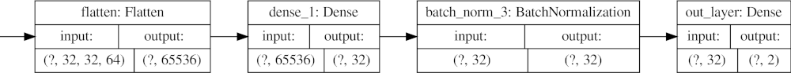

# GoGet (gg) project - description

The general idea for this work comes from [4], which classifies COVID-19
lung CT images. In [4] the authors create a system divided in 3 phases (features extraction, selection
and classification). This project aims at replicating the same steps, but I am responsible for how the
components are connected, since the paper does not describe in details how to join the various components
codewise. Also, I could not find their code online to use as reference, at the time of this project. In my
system, the feature extraction phase is completed by a CNN, while a Decision tree is responsible for
the feature selection. The final classification is completed by an ensemble, since it can normally achieve
better results than a single classifier [4]. Initially, I considered the option of exploiting a pre-trained
network for the feature extraction phase (like the previous mentioned paper), but I decided to create a
custom network because I wanted to practice on how to create, design and tune the model. Nonetheless, I
investigated the alternative of a pre-trained network, and I would suggest utilizing a “Stylized-ImageNet”
CNN [5], because it is very good to extract shape features from images instead of focusing on textures
details. Further, I considered feeding only regions of interest (ROI) to the feature extraction phase, but
I ran in some trouble understanding and detecting ROIs with CT colon images in a reasonable amount
of time, therefore I decided to consider the whole image as sample for the feature extraction step. One
important factor, which led me to choose this dataset, is the fact that the TCIA colonography dataset
(see section 2.1) has mostly been used to complete segmentation and data analysis tasks so far [13], hence
there are no Machine learning papers about it (only pattern analysis). The appendix presents the ids
from the dataset used in the various steps of this work. The
solution is implemented in Python (version 3.8.5) with Tensorflow and scikit-learn (environment: Linux).

## Related works

This project is based on a novel paper (published this year), so I could only find similar works focusing
only on certain parts of my solution. The dataset contains many images in different position (supine,
prone) of the colon, so I looked into the SoA for a reason and I found out that both supine and prone
position are important to “increase the sensitivity of polyp detection” [2]. A noteworthy work, for colon
polyp identification, is the one from Ribeiro and Uhl [10]. In this paper, the authors exploit a CNN to
extract features from colored images and achieve accuracy values higher than 90 % in their experiments.
Also, their method is remarkable because it puts together patches of images to deal with datasets with
few images. A good start about compressing 3D images and segmenting ROIs with CT colon images, is
the study of Gokturk, Tomasi and Beaulieu [6]. This paper is useful because it shows how to segment the
ROIs area for a colon image. A work focusing on morphological features is the one from Ren et al. [9].
The authors explain how CAD (Computer-aided detection) systems are important in radiology to detect
features in CT images. The discoveries I find interesting about this study are: the polyp segmentation
(useful for ROIs) needs to cover the “centers of the largest and smallest polyps” for the feature map; the
features they acquired do not work for flat or small polyps for which there is no texture.

# Preprocessing

First the DICOM files, from the TCIA dataset, are converted to numpy arrays, which are then saved
in h5 datasets. Further, the data is augmented by resizing the images from 512x512 to 256x256 and
rescaled by a factor of 255 (example in figure 2). One thing that I noticed during the early phases of this
work, is that the vast majority of the images are similar to figure 1. Since the images belong to the same
class and they are a very small amount, then they should not create too much ’noise’ or create a class
imbalance problem, because they belong to the same class. Also, it is important to consider both supine
and prone position in scanning CT colonography [2]. Further, to avoid a class imbalance problem, this
project aims to use the same amount of sample for the negative and positive class by taking the same
number of images from the TCIA dataset. Additionally, the quantity of positive class images is evenly
divided between > 10 mm (millimeters) polyps and 6 to 9 mm polyps found.

Figure 1: Example images from the dataset (different orientations), no polyps found images (the id of
the images is shown in the bottom of the picture): 


Figure 2: Example of an image after the preprocessing tasks:


## Notes 

Note: the system was developed and tested in a Linux environment (5.4.0-56-generic) with Python version
3.8.5
The TCIA dataset is released under the [Creative Commons Attribution 3.0 Unported License] (https://creativecommons.org/licenses/by/3.0/).

## How the system works 
In general, the steps followed by this system are:\
	0. Convert .dcm images to .h5 datasets.\
	1. Train the CNN component using both classes of images.\
	2. Feed the input images representing the positive class (100 images) (images of
		10 mm polyps and 6 to 9 mm polyps) to the CNN to find the features
		related to the positive class. Then, do the same for the negative class images (50 images for 10 mm and 50 images
		for 6 to mm polyps images).\
	3. Negatives and positives features are combined and fed to a feature selection 
		component.\
	4. The output of the feature selection is fed to the Voting classifier.

### Conversion pngs to h5s 
Before using the main.py file, the DICOM images (.dcm) must be converted to .png images,
and the png images must be converted to .h5 files which are used by the CNN in main.py as input.
The conversion from .dcm to .png is done by the function: 
```
	convert_dcm_to_png(dcm_folder, new_dir_path)
```
while the conversion from .png to .h5 is completed by the function:
```
	convert_image_to_numpy(
        path_xls_no_polyp,
        path_xls_10_polyp,
        path_xls_6_9_polyp,
        new_dir_path,
        npy_dir
    )
```
Both functions are in the file in tcia_dcm_to_numpy.py.
Note the script does not delete the .png images created after they are converted to .h5 files.
Run the file convert_dcm_to_h5.py to apply the conversion .dcm -> .png -> .h5 files.

### Example how to load datasets after conversion to numpy arrays
In the example below 'folder' is the path as a string where the datasets are
saved (default location is: 'data/npy-polyps-arrays').
The variables: np, p_10, p_6_9 will contain the 3 different datasets as numpy
arrays with shape (X, 256, 256, 4).
```
def test_load_h5(folder):
    with h5py.File(folder + os.sep + 'no-polyp.h5', 'r') as hf:
        np = hf['no_polyp'][:]
    with h5py.File(folder + os.sep + 'polyp-10.h5', 'r') as hf:
        p_10 = hf['polyp_10'][:]
    with h5py.File(folder + os.sep + 'polyp-6-9.h5', 'r') as hf:
        p_6_9 = hf['polyp_6_9'][:]
```

# Directory description
This section explains what each directory contains and its requirements (if
there are any).\
	- 'data/': contains all data used by this project.\
	- 'data/CT_COLONOGRAPHY': contains all DICOM images (.dcm files)
	  downloaded from the TCIA website. Do not store anything else,
		or the script tcia_dcm_to_numpy.py will not work properly.\
	- 'data/new-pngs': contains all converted images (from .dcm to .png) from 
	the dataset. Do not store anything else, or the script tcia_dcm_to_numpy.py will not work properly.\
	- 'data/allh5s-new': contains the numpy arrays for the dataset
	saved as .h5 files.\
	- 'images/': contains useful images to show in README.md\
	- 'config.csv': contains the parameters for the program (see section below to understand how to set the file)\
	- 'blacklist.txt': where to save polyps ids used\
	- 'main.py': where the features extraction, CNN training functions are stored\
	- 'tcia_dcm_to_numpy.py': functions to convert .dcm to .png to .h5\
	- 'tests.py': unit tests functions\
	- 'utils.py': utilities function (eg: print data and save images)

## How to set paths for converting DICOM files and model parameters
The file config.csv contains the paths (as string) to use for converting .dcm to .png to .h5 files.
The paths do not need to contain quote marks (', "), their meaning is as follows:
- pathPngs: path where to store the pngs images.
- pathH5s: path where to save the .h5 files.
- pathXlsNoPolyp: path where the .xls file for no polyps ids from TCIA is stored.
- pathXls10Polyp: path where the .xls file for 10 mm polyps ids from TCIA is stored.
- pathXls69Polyp: path where the .xls file for 6 to 9 mm polyps ids from TCIA is stored.
- batchSize: batch size for .fit() call of the models.
- pathPosFtrs: path where to find the positive extracted features.
- pathNegFtrs: path where to find the negative extracted features.
- pathWeights: path of keras checkpoint of weight to load.
- pathResumeTrainFromCkpt: path of keras checkpoints from which to resume training.
- pathSaveModel: path where to save keras models.
- pathSaveImages: path where the model should save the results images of accuracy, loss, and so on.
- pathCkptsSave:
- dcmFolder: path where the dcm images are stored.
- doFeatureExtraction: either "True" or "False", flag to indicate whether to run the feature extraction component.
- doClassification: either "True" or "False", flag to indicate whether to run the classification of features component.


# Dataset 
The TCIA(The Cancer Imaging Archive), available under the Creative Commons Attribution 3.0 Un-
ported License, dataset contains a total of 941771 images, collected from 825 participants and 836 studies
1
 . The dataset comprises CT images of patient affected by colon polyps with size either higher than 10
mm or 6 to 9 mm or no polyps at all. The images are grouped together with an identification system
[13] and the ids are stored in xls files (see figure 3). The data uses the DICOM (Digital Imaging and
Communications in Medicine) format, which is an international standard for medical images [3]. After
downloading the data, all files are stored under a directory with a certain id specified in the xls files (it
is possible to download the xls from the TCIA website).

Figure 3a: xls file with the ids and lesion information of
the more than 10 mm size of polyps found:


Figure 3b: xls file with the ids of the no polyp images
found: 

# Methodology
Figure 4 depicts the workflow of the system. The solution operates in the following manner:
1. The user downloads the desired images from the TCIA dataset and uses the system’s scripts to
convert them to h5s.
2. The CNN is trained on the user specified h5 datasets to classify images in two classes. The positive
class (polyps found) consists of samples of > 10 mm and 6 to 9 mm polyps images, while the
negative class is made of no polyp found images.
3. A new instance of a CNN with the same architecture and weights from point (2) is applied to
extract features (layer’s weights of the CNN) from the user specified h5 dataset (different from the
previous point).
   
	* (3a) Feed the CNN only positive class (polyps present) images, in batches of 100 samples (half for
	more than 10 mm polyps and half for 6 to 9 mm polyps) a time, to extract only positive features.
	* (3b) Feed the CNN only negative class (no polyp found) images, in batches of 100 samples a time,
	to extract only negative features.
	* (3c) Combine the data from the previous two points.

4. The newly found features are fed to a feature selection algorithm.
5. The output of the feature selection is given as input to the voting classifier. The feature selection is
completed by a randomized decision tree, which works on lots of sub-samples to avoid overfitting
and increase the prediction accuracy. The voting classifier comprises 3 components:
   
	* DT (Decision Tree) classifier
	* SVM (Support Vector Machine) classifier
	* KNN (K-Nearest Neighbor) classifier
   
Figure 4: General system architecture. This picture shows the general workflow of the system:


Note that, after downloading the TCIA dataset, the files need to be converted to h5 format. This
is done because DICOM contains lots of information which is not needed for this project and it is
easier to work with a large amount of data in Python, if stored in h5 files. The DICOM images
are first converted to pngs, then the RGBA images are converted to numpy arrays and stored in
h5 datasets. The system create three h5 dataset (one for > 10 mm polyps, 6 to 9 mm polyps,
no polyps found) and implements a chunking technique to improve the access speed to the data.
Figure 5 depicts the CNN architecture used to extract features after being trained to classify them.
The batch normalization layer is useful to raise the speed of training of the CNN [7]. I decided to
apply a Max pooling layer after the Convolutional layer because it is more common. Instead, The
order of batch normalization (first) and dropout (after batch normalization) comes the work of Li
et al. [8].

Figure 5: CNN architecture. First an instance of this network is trained to classify images for the positive
and negative class, then it is applied to extract features from input images:




# Experiments

The inner layers of the CNN employ a ReLU as activation function, hence to avoid the problem of
vanishing gradient, the layers apply a “He initialization” [1] to initialize the weights. The CNN is trained
for 20 epochs with a batch size of 4. Further, it uses a binarycrossentropy loss function during the
first classification step. The CNN is trained and validated with 1585 negative class images and 1600
positive class images (evenly divided between > 10 mm polyps and 6 to 9 mm polyps found images). I
experimented with the Voting classifer by utilizing 2 different voting schemes:

- ’soft’: the classifier “predicts the class label based on the argmax of the sums of the predicted
probabilities” [12].
- ’hard’: the classifier “uses predicted class labels for majority rule voting” [12].

Both the ensemble and the feature selection components set their hyperparameter thanks to Grid-search.
Also, The Voting classifier divides the data in 80 % for training and 20 % for validation, while the CNN
uses 90 % for training and 10 % for validation. Also, the feature extraction process employs a total of
17400 images.

# Results and Discussion

The Grid-search for the feature selection with the random decision tree produces the following parameters
[11]:
- ’criterion’: ’gini’, measures the quality of a split.
- ’max depth’: 10, maximum depth of a tree.
- ’max features’: ’log2’, number of features to consider during the search for the best split.
- ’min samples leaf’: 1, minimum number of samples to be a leaf.
- ’min samples split’: 6, minimum number of samples to split an internal node.

Instead, the Grid-search for the voting classifier generates the following results:
- Decision Tree:
	* ’max depth’: 4,
	* ’min samples leaf’: 0.5,
	* ’min samples split’: 0.5
- K-Nearest Neighbor:
	* ’n neighbors’: 7, number of neighbors of a point.
- Support Vector Machine:
	* ’C’: 1.0, regularization parameter.
	* ’gamma’: 0.001, kernel coefficient.
	* ’kernel’: ’linear’
  
Figure 6 depicts the results (accuracy, loss) of training and validation of the CNN to classify the input
polyps images.
Figure 7 presents the confusion matrix of the results of the classification completed by the Voting
classifer. The ensemble reaches an accuracy of 0.91 during training and 0.885 during validation. Table 1
reports the values of precision and recall. Also, the Voting classifier results are the same when applying
different voting scheme (soft, hard).
The batch size of the CNN is rather low because higher values would consume too much memory of
my computer, thus I set the parameter with the highest value such that my machine would not crash.

Figure 6: Accuracy and loss of the CNN during training to learn to classify polyps images (x-axis =
accuracy/loss, y-axis=number of epoch). The CNN is trained on a total of 1585 images of no polyp, 800
images of 10 mm polyp and 800 images of 6 to 9 mm polyp (1600 for the positive class). 90 % of the
data used for training, 10 % for validation,

(a) Half training (reached 1600 samples):


(b) reached 3185 samples:


Figure 7: Confusion matrix of the Voting classifier (DT, SVM, KNN) for training and validation,

(a) Training:


(b) Validation:


Table 1: Voting classifier aproximated values of recall and precision during training/validation:

|            | Precision | Recall |
|------------|-----------|--------|
|  training  | 0.9       | 0.51   |
| validation | 0.81      | 0.54   |

The number of epochs is 20 to avoid taking too many hours of computation on my machine. The Grid-
search on the Voting classifier, for the SVM, seems to favour a linear kernel and uses the suggested
(from scikit-learn) default value of the regularization parameter ’C’ equal to 1. The results of precision
and recall are consistent with the theory, since we can not have high precision and recall at the same
time (trade-off). The accuracy of the ensemble is lower during validation but this is expected given the
amount of data considered. One positive remark is that the accuracy is higher than the one I showed in
the final presentation (about 0.7), since I trained the model with more data it was expected but still it is
a favourable outcome. The first phase comprises the training and validation of the CNN, using as input
the polyps images. So, the classification accuracy (first phase), in the first half of the training (picture
6a), remains quite stable during all epochs, oscillating in a range between 0.82 and 0.9. Instead, in the
second part of the training (picture 6b), the accuracy is always better than the previous image (higher
than 0.9) but it goes up and down more swiftly in a small range between 0.92 and 0.95. While, the
classification accuracy for validation, during the first half (picture 6a), surges in the first 4 epochs, then
slightly decline between the 4th and 6th epochs and then gets back up to 0.99 and keeps steady. This
behavior might be caused by the low amount of data used till that point (the same applies to image 6b),
a solution might be to increase the percentage of data used for validation from 10 % to 20 %.

# Conclusion and future works
In the end, I created a system capable of classifying images using a CNN, then to try to improve the
perfomance, the system aims at extracting features from the dataset and classify them. The results
are good but more experiments are needed to further prove the effectiveness of the proposed solution.
As future works I would like to apply the pre-trained network mentioned in the introduction (“Stylized-
ImageNet”), further it would be interesting to apply the feature extraction step only on ROIs and confront
it with the extraction with full images. Moreover, since both supine and prone orientation are important
for polyps detection, then I would like to apply the workflow on the different type of images separately to
study the difference in performance when dealing with both or only one type of orientation. Unluckily, I
could not finish in time the last part, exploiting the learned features to classify new input images in the
ensemble (I only classify features), due to time constraint to implement, debug and run the code. So, as
future work I would propose to complete this last part with the current ensemble (the problem is how
to include the learned features in the classification task with the scikit-learn API of an ensemble). Or,
the alternative would be to create an ensemble of neural networks, which would make it easier to include
the learned features with the networks since they only need a layer compatible with the learned features
size (the only problem may be codewise: how to combine Tensorflow networks with scikit-learn ensemble
API). 

## Appendix

### List of no polyp found ids (CNN training & validation)
1.3.6.1.4.1.9328.50.4.0002
1.3.6.1.4.1.9328.50.4.0003
1.3.6.1.4.1.9328.50.4.0004
1.3.6.1.4.1.9328.50.4.0009
1.3.6.1.4.1.9328.50.4.0010

### List of 10 mm polyp found ids (CNN training & validation)
1.3.6.1.4.1.9328.50.4.0040
1.3.6.1.4.1.9328.50.4.0136
1.3.6.1.4.1.9328.50.4.0175

### List of 6 to 9 mm polyp found ids (CNN training & validation) 
1.3.6.1.4.1.9328.50.4.0080
1.3.6.1.4.1.9328.50.4.0132

### List of no polyp found ids (features extraction)
1.3.6.1.4.1.9328.50.4.0005
1.3.6.1.4.1.9328.50.4.0006
1.3.6.1.4.1.9328.50.4.0011
1.3.6.1.4.1.9328.50.4.0012
1.3.6.1.4.1.9328.50.4.0013
1.3.6.1.4.1.9328.50.4.0015
1.3.6.1.4.1.9328.50.4.0016
1.3.6.1.4.1.9328.50.4.0017
1.3.6.1.4.1.9328.50.4.0018

### List of 10 mm polyp found ids (features extraction)
1.3.6.1.4.1.9328.50.4.0345
1.3.6.1.4.1.9328.50.4.0518
1.3.6.1.4.1.9328.50.4.0233
1.3.6.1.4.1.9328.50.4.0259
1.3.6.1.4.1.9328.50.4.0272
1.3.6.1.4.1.9328.50.4.0290
1.3.6.1.4.1.9328.50.4.0326
1.3.6.1.4.1.9328.50.4.0331

### List of 6 to 9 mm polyp found ids (features extraction)
1.3.6.1.4.1.9328.50.4.0154
1.3.6.1.4.1.9328.50.4.0156
1.3.6.1.4.1.9328.50.4.0216
1.3.6.1.4.1.9328.50.4.0242
1.3.6.1.4.1.9328.50.4.0264
1.3.6.1.4.1.9328.50.4.0289
1.3.6.1.4.1.9328.50.4.0347
1.3.6.1.4.1.9328.50.4.0354

# References
 1) Arpit, D., and Bengio, Y. The benefits of over-parameterization at initialization in deep relu
networks. arXiv preprint arXiv:1901.03611 (2019).
 2) Chen, S. C., Lu, D., Hecht, J. R., and Kadell, B. Ct colonography: value of scanning in both
the supine and prone positions. AJR. American journal of roentgenology 172, 3 (1999), 595–599.
 3) DICOM. Dicom format. https://www.dicomstandard.org/about-home.
 4) El-Kenawy, E.-S. M., Ibrahim, A., Mirjalili, S., Eid, M. M., and Hussein, S. E. Novel
feature selection and voting classifier algorithms for covid-19 classification in ct images. IEEE Access
8 (2020), 179317–179335.
 5) Geirhos, R., Rubisch, P., Michaelis, C., Bethge, M., Wichmann, F. A., and Brendel,
W. Imagenet-trained cnns are biased towards texture; increasing shape bias improves accuracy and
robustness. arXiv preprint arXiv:1811.12231 (2018).
 6) Gokturk, S. B., Tomasi, C., Girod, B., and Beaulieu, C. Medical image compression based
on region of interest, with application to colon ct images. In 2001 Conference Proceedings of the 23rd
Annual International Conference of the IEEE Engineering in Medicine and Biology Society (2001),
vol. 3, IEEE, pp. 2453–2456.
 7) Ioffe, S., and Szegedy, C. Batch normalization: Accelerating deep network training by reducing
internal covariate shift. arXiv preprint arXiv:1502.03167 (2015).
 8) Li, X., Chen, S., Hu, X., and Yang, J. Understanding the disharmony between dropout and
batch normalization by variance shift. In Proceedings of the IEEE conference on computer vision
and pattern recognition (2019), pp. 2682–2690.
 9) Ren, Y., Ma, J., Xiong, J., Chen, Y., Lu, L., and Zhao, J. Improved false positive reduction
by novel morphological features for computer-aided polyp detection in ct colonography. IEEE journal
of biomedical and health informatics 23, 1 (2018), 324–333.
 10) Ribeiro, E., Uhl, A., and Häfner, M. Colonic polyp classification with convolutional neural net-
works. In 2016 IEEE 29th International Symposium on Computer-Based Medical Systems (CBMS)
(2016), IEEE, pp. 253–258.
 11) sklearn.
 sklearn extratreesclassifier api.
 https://scikit-learn.org/stable/modules/
generated/sklearn.ensemble.ExtraTreesClassifier.html.
 12) sklearn.
 sklearn method documentation.
 https://scikit-learn.org/stable/modules/
generated/sklearn.ensemble.VotingClassifier.html.
 13) TCIA. Tcia dataset details. https://wiki.cancerimagingarchive.net/display/Public/CT+
COLONOGRAPHY#3539213bc030a1baaff4fc28093435d2a56b883.
14) [TCIA dataset] (https://wiki.cancerimagingarchive.net/display/Public/CT+COLONOGRAPHY#3539213deca74644fb24f819129e8bb8f2a3658)
15) [download TCIA colonoscopy] (https://public.cancerimagingarchive.net/nbia-search/)
16) [instructions (video), how to download the dataset] (https://www.youtube.com/watch?v=NO48XtdHTic&feature=youtu.be)
17) [El-Kenawy, El-Sayed M., et al. "Novel feature selection and voting classifier algorithms for COVID-19 classification in CT images." IEEE Access 8 (2020): 179317-179335.] (https://ieeexplore.ieee.org/stamp/stamp.jsp?arnumber=9209966)
18) [classification on imbalanced data] (https://www.tensorflow.org/tutorials/structured_data/imbalanced_data)
